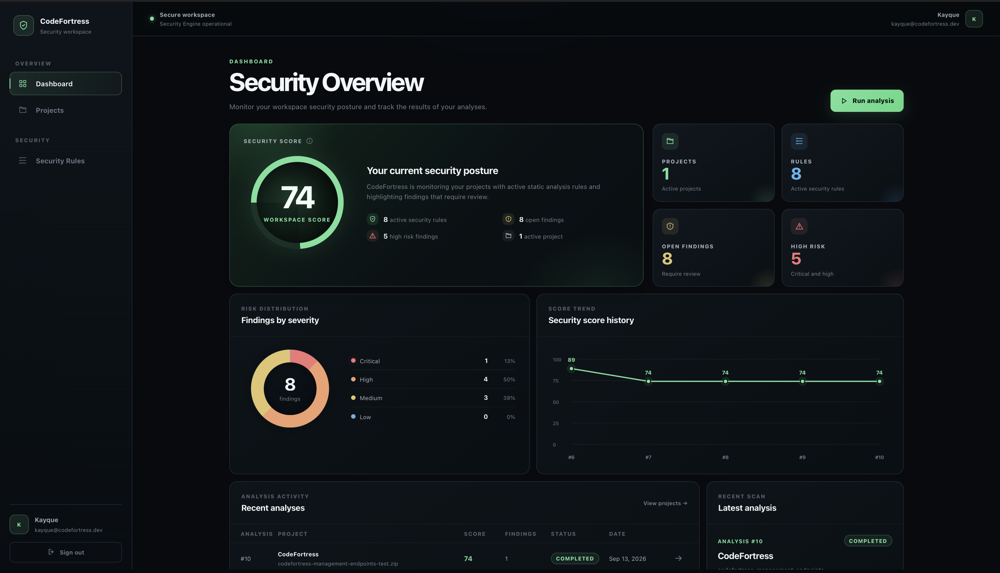
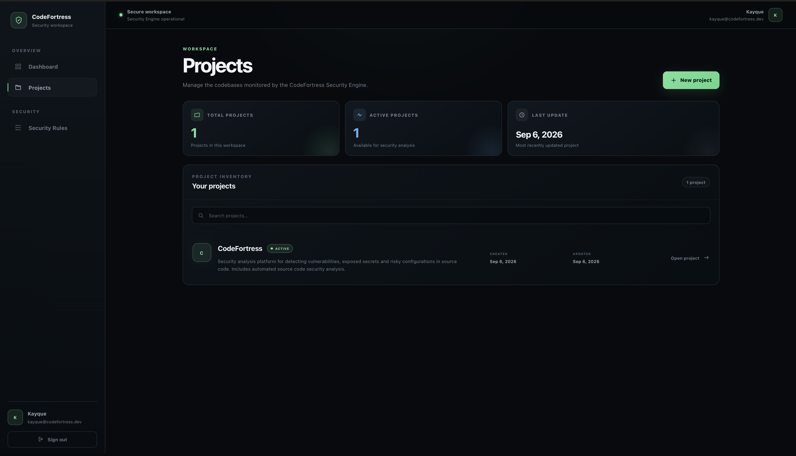
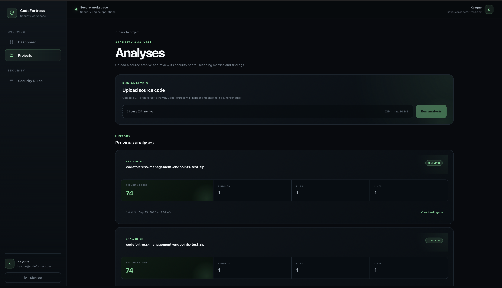
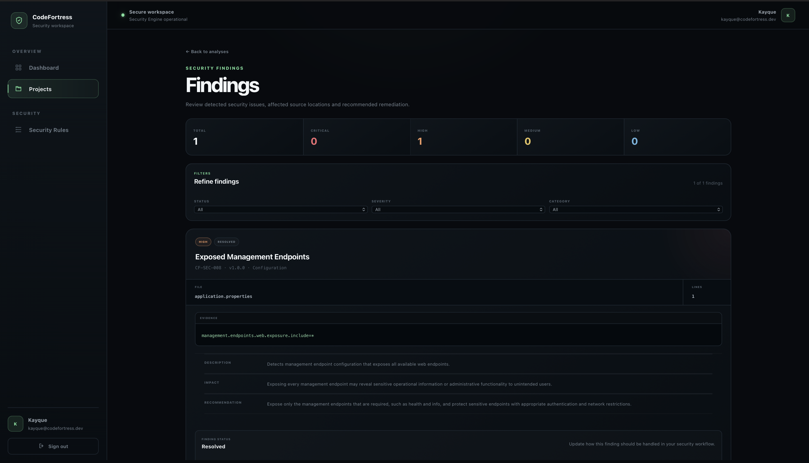
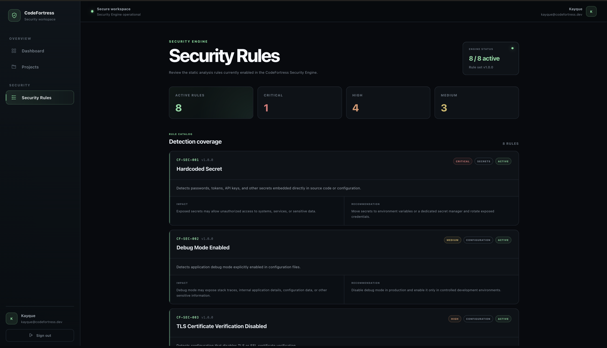

# CodeFortress

[English](README.md) | [Português](README.pt-BR.md)


CodeFortress is a full-stack static application security analysis platform designed to identify security risks in source code and configuration files.

It allows developers to organize projects, upload source code archives, execute asynchronous security analyses, review detected findings, track security scores, and manage the remediation workflow through a modern web interface.

The current stable release is **v2.0.0**.

---

## Overview

CodeFortress was built as a practical application security platform focused on deterministic static analysis.

The main workflow is:

```text
Project
   |
   v
Source Code Upload
   |
   v
Asynchronous Analysis
   |
   v
Security Engine
   |
   v
Findings
   |
   v
Security Score
   |
   v
Triage and Remediation
```

Each completed analysis produces security findings containing contextual information such as severity, affected file, code evidence, impact, recommendation, and remediation status.

---

## Interface

The CodeFortress V2 interface was redesigned around a cybersecurity-focused workspace with responsive layouts for desktop and mobile devices.

### Security Dashboard

The dashboard consolidates the current security posture, severity distribution, Security Score history and recent analysis activity.



### Projects

Projects provide isolated workspaces for organizing source code analyses and reviewing their security history.



### Analyses

Each project maintains an analysis history containing its Security Score, findings count, scanned files and scanned lines.



### Findings

Findings provide the detected rule, severity, affected source location, evidence, impact, remediation recommendation and workflow status.



### Security Rules

The Security Rules catalog documents the deterministic checks currently enabled in the CodeFortress Security Engine.



---

## Main Features

### Authentication

- User registration
- Email and password login
- JWT access tokens
- Refresh token sessions
- Refresh token rotation
- Protected application routes
- Logout
- Automatic session recovery

### Project Management

- Create projects
- Edit project name and description
- List active projects
- View project details
- Archive projects
- User-level resource isolation

### Source Code Analysis

- ZIP source code upload
- Archive validation
- Secure archive extraction
- Source file discovery
- Asynchronous analysis execution
- Analysis lifecycle tracking
- Files scanned metrics
- Lines scanned metrics
- Analysis history per project

Supported analysis states include:

```text
QUEUED
RUNNING
COMPLETED
FAILED
CANCELLED
```

### Security Findings

Each finding may contain:

- Rule key and version
- Title
- Category
- Severity
- Workflow status
- Affected file
- Start and end lines
- Code evidence
- Description
- Security impact
- Recommendation
- Finding fingerprint
- Creation and update timestamps

Finding workflow statuses:

```text
OPEN
RESOLVED
ACCEPTED_RISK
FALSE_POSITIVE
```

Resolved or classified findings can also be reopened.

### Finding Filters

Findings can be filtered by:

- Status
- Severity
- Category

### Dashboard

The security dashboard provides an aggregated view of the workspace, including:

- Security Score
- Active projects
- Security rules
- Open findings
- High-risk findings
- Severity distribution
- Recent Security Score history
- Recent analyses
- Latest completed analysis

---

## Security Engine

CodeFortress v2.0.0 contains eight deterministic static analysis rules.

| Rule | Detection | Severity |
|---|---|---|
| `CF-SEC-001` | Hardcoded Secret | Critical |
| `CF-SEC-002` | Debug Mode Enabled | Medium |
| `CF-SEC-003` | TLS Certificate Verification Disabled | High |
| `CF-SEC-004` | Permissive CORS Configuration | Medium |
| `CF-SEC-005` | SQL Injection Risk | High |
| `CF-SEC-006` | Weak Cryptographic Hash Algorithm | Medium |
| `CF-SEC-007` | Sensitive Information Exposure | High |
| `CF-SEC-008` | Exposed Management Endpoints | High |

These rules identify **potential security risks through static analysis**.

A detected finding does not automatically prove that the analyzed application is exploitable. Findings should be reviewed within the context of the analyzed application.

---

## Security Score

Each completed analysis receives a Security Score ranging from `0` to `100`.

The score starts at:

```text
100
```

and decreases according to the findings detected during the analysis.

Current severity weights:

| Severity | Penalty |
|---|---:|
| Critical | 18 |
| High | 8 |
| Medium | 3 |
| Low | 1 |

The score represents the security posture of a specific analysis and is preserved as historical data.

Changing a finding workflow status does not recalculate a historical analysis score.

---

## Architecture

CodeFortress uses a full-stack architecture composed of a Spring Boot backend, a React frontend, and a PostgreSQL database.

### Backend

The backend follows a modular monolith approach.

Main application areas include:

```text
com.codefortress
├── identity
├── project
├── analysis
├── dashboard
└── shared
```

The analysis module contains the source code processing pipeline, rule execution, findings persistence, scoring, and analysis lifecycle management.

### Frontend

The frontend is organized by application features.

```text
src
├── app
├── features
├── lib
└── styles
```

Server state is managed with TanStack Query, while forms use React Hook Form and Zod validation.

---

## Technology Stack

### Backend

- Java 21
- Spring Boot 4.1.1
- Spring MVC
- Spring Security
- Spring Data JPA
- OAuth2 Resource Server
- Bean Validation
- Spring Boot Actuator
- PostgreSQL
- Flyway
- H2 for automated tests
- Maven

### Frontend

- React 19
- TypeScript 6
- Vite 8
- React Router 8
- TanStack Query 5
- React Hook Form 7
- Zod 4
- Oxlint

### Infrastructure

- Docker
- Docker Compose
- PostgreSQL 17 Alpine

---

## Database

Database schema evolution is managed with Flyway.

Current migrations:

```text
V1 - users
V2 - refresh_tokens
V3 - projects
V4 - analyses
V5 - findings
```

PostgreSQL is used in the development environment.

H2 in-memory database is used during automated tests.

---

## Repository Structure

```text
codefortress/
├── backend/
│   ├── src/
│   ├── pom.xml
│   └── mvnw
│
├── frontend/
│   ├── src/
│   ├── public/
│   ├── package.json
│   └── vite.config.ts
│
├── docs/
├── compose.yml
├── .env.example
└── README.md
```

---

## Running Locally

### Requirements

Install the following tools before running CodeFortress:

- Java 21
- Node.js
- npm
- Docker
- Docker Compose

### Clone the Repository

```bash
git clone https://github.com/kayquemigueldev/codefortress.git
cd codefortress
```

### Configure Environment Variables

Create your local environment file:

```bash
cp .env.example .env
```

Example:

```env
POSTGRES_DB=codefortress
POSTGRES_USER=codefortress
POSTGRES_PASSWORD=change_this_local_password
POSTGRES_PORT=5432

JWT_SECRET=replace_with_at_least_32_random_characters
JWT_ISSUER=codefortress-api
JWT_ACCESS_TOKEN_TTL=15m
JWT_REFRESH_TOKEN_TTL=P30D
REFRESH_COOKIE_SECURE=false
```

The `.env` file must not be committed.

### Start PostgreSQL

From the repository root:

```bash
docker compose up -d
```

### Start the Backend

On macOS or Linux:

```bash
set -a
source .env
set +a

cd backend
./mvnw spring-boot:run
```

The backend runs locally on:

```text
http://localhost:8080
```

### Start the Frontend

Open another terminal:

```bash
cd frontend
npm install
npm run dev
```

The Vite development server proxies `/api` requests to the local backend.

---

## Automated Tests

Run the complete backend test suite with:

```bash
cd backend
./mvnw clean test
```

Validated result for `v2.0.0`:

```text
Tests run: 297
Failures: 0
Errors: 0
Skipped: 0

BUILD SUCCESS
```

The automated test suite covers areas including:

- Authentication
- Refresh tokens
- Users
- Projects
- Project archiving
- Source archive upload
- Secure archive extraction
- Source file discovery
- Analysis lifecycle
- Analysis execution
- Security rules
- Finding generation
- Finding fingerprints
- Finding persistence
- Finding workflow status
- Security Score
- Dashboard
- API controllers

---

## Frontend Validation

Production build:

```bash
cd frontend
npm run build
```

Lint:

```bash
npm run lint
```

The `v2.0.0` production build was successfully validated before release.

---

## Responsive Interface

The V2 interface supports desktop and mobile layouts.

Manual responsive QA was performed using a `390 x 844` mobile viewport.

The validation included:

- Dashboard
- Projects
- Project Overview
- Analyses
- Findings
- Project creation
- Project editing
- Security Rules
- Mobile navigation
- Long content pages
- Form actions

---

## Version 2.0 Validation

CodeFortress `v2.0.0` was manually validated with the following application flows:

- Project creation
- Project editing
- Project archiving
- Source archive upload
- Analysis execution
- Finding detection
- Finding evidence visualization
- Finding workflow updates
- Finding reopening
- Status filters
- Severity filters
- Category filters
- Dashboard refresh
- Logout
- Login
- Responsive navigation
- Production frontend build
- Complete backend test suite

---

## Releases

### v2.0.0

Version 2 introduced a complete interface redesign and user experience overhaul while preserving the security analysis engine and existing backend behavior.

Major improvements include:

- Redesigned security dashboard
- Redesigned projects interface
- Redesigned project overview
- Redesigned analysis workflow
- Redesigned findings interface
- Redesigned project forms
- Redesigned Security Rules catalog
- Responsive mobile experience
- Improved severity visualization
- Improved Security Score presentation
- Complete manual QA validation

### v1.0.0

The first stable CodeFortress release introduced the core application workflow:

- Authentication
- Projects
- Source code analysis
- Security Engine
- Findings
- Security Score
- Dashboard

---

## Roadmap

Future versions may explore features such as:

- Direct GitHub repository integration
- Remote repository analysis
- Analysis comparison
- Security report export
- Additional static analysis rules
- Security Engine configuration
- Improved observability

---

## Author

Developed by **Kayque Miguel**.

GitHub: [kayquemigueldev](https://github.com/kayquemigueldev)

---

CodeFortress
Analyze code. Find risks. Strengthen security.
