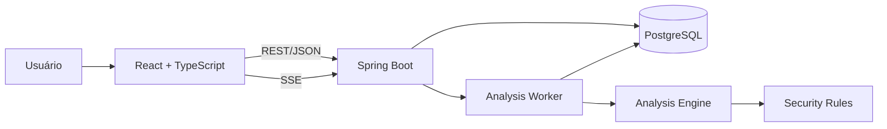

# CodeFortress — Arquitetura

## Visão geral

O CodeFortress será organizado como um monorepo com duas aplicações independentes:

```text
codefortress/
├── backend/
├── frontend/
└── docs/
```

- `backend`: API, autenticação, regras de negócio, análise de código e persistência.
- `frontend`: interface acessada pelo navegador.
- `docs`: decisões arquiteturais e documentação do produto.

## Arquitetura do sistema



## Tecnologias

### Backend

- Java 21
- Spring Boot
- Spring Web
- Spring Security
- JWT
- Spring Data JPA
- Hibernate
- PostgreSQL
- Flyway
- Maven
- JUnit
- Mockito
- Testcontainers

### Frontend

- React
- TypeScript
- Vite
- React Router
- TanStack Query
- React Hook Form
- Zod
- Recharts

### Infraestrutura

- Docker
- Docker Compose
- GitHub Actions

## Decisão: monólito modular

O backend será uma única aplicação Spring Boot, dividida em módulos por funcionalidade.

```text
com.codefortress
├── auth
├── project
├── analysis
├── engine
├── finding
├── dashboard
├── report
└── shared
```

### Motivo

Um monólito modular oferece:

- desenvolvimento mais simples;
- apenas um backend para executar;
- transações de banco mais fáceis;
- deploy mais simples;
- menos infraestrutura;
- separação clara entre funcionalidades.

O sistema poderá ser dividido em serviços no futuro caso exista uma necessidade real.

## Organização interna dos módulos

Cada módulo poderá conter:

```text
api/
application/
domain/
infrastructure/
```

### `api`

Recebe requisições HTTP e devolve respostas.

Contém:

- controllers;
- DTOs de entrada;
- DTOs de saída;
- validação do formato da requisição.

### `application`

Coordena os casos de uso.

Exemplos:

- cadastrar usuário;
- criar projeto;
- iniciar análise;
- alterar status de finding.

### `domain`

Contém as regras de negócio.

Exemplos:

- entidades;
- enums;
- cálculos;
- validações de domínio;
- interfaces de repositório.

### `infrastructure`

Implementa comunicação com recursos externos.

Exemplos:

- JPA;
- PostgreSQL;
- geração de JWT;
- armazenamento de arquivos;
- geração de PDF.

## Fluxo de uma requisição

```text
HTTP Request
    ↓
Controller
    ↓
Application Service
    ↓
Domain
    ↓
Repository
    ↓
PostgreSQL
```

Controllers não devem conter regras de negócio. Sua responsabilidade é receber, validar e encaminhar dados.

Entidades JPA não devem ser devolvidas diretamente pela API. A API utilizará DTOs para controlar o formato das respostas.

## Analysis Engine

O motor de análise ficará isolado do restante da aplicação.

```text
Arquivo ZIP
    ↓
Validação segura
    ↓
Extração temporária
    ↓
Descoberta de arquivos
    ↓
Leitura como texto
    ↓
Seleção de regras compatíveis
    ↓
Execução das regras
    ↓
Geração de findings
    ↓
Cálculo do Security Score
    ↓
Persistência
```

Contrato principal planejado:

```java
public interface SecurityRule {

    RuleMetadata metadata();

    boolean supports(ScannableFile file);

    List<RuleMatch> evaluate(
        ScannableFile file,
        AnalysisContext context
    );
}
```

Cada regra implementará essa interface.

Exemplos:

```text
SecurityRule
├── HardcodedSecretRule
├── PrivateKeyRule
├── InsecureCorsRule
├── DebugConfigurationRule
├── SqlInjectionPatternRule
└── SensitiveLoggingRule
```

O motor de análise não poderá depender de controllers, HTTP ou componentes visuais.

## Processamento assíncrono

Uma análise pode levar vários segundos. Por isso, a requisição não ficará aberta esperando o processamento terminar.

Fluxo:

```text
Frontend solicita análise
    ↓
Backend cria Analysis com status QUEUED
    ↓
Backend responde com o ID
    ↓
Worker inicia processamento
    ↓
Status muda para RUNNING
    ↓
Eventos de progresso são registrados
    ↓
Findings e score são salvos
    ↓
Status muda para COMPLETED ou FAILED
```

No MVP, o worker fará parte da aplicação Spring Boot.

Uma fila externa poderá ser adicionada futuramente caso o sistema precise executar múltiplas instâncias.

## Comunicação em tempo real

Será utilizado Server-Sent Events — SSE.

O backend enviará eventos para o navegador:

```text
Repository loaded
Files discovered
Source analysis started
Configuration analysis started
Security rules completed
Analysis finished
```

SSE foi escolhido porque precisamos principalmente de comunicação do servidor para o navegador.

WebSocket seria mais complexo e não oferece vantagem necessária para esse fluxo.

## Banco de dados

O PostgreSQL será a fonte oficial dos dados.

Alterações na estrutura do banco serão feitas através de migrations do Flyway.

Não utilizaremos o Hibernate para modificar automaticamente o banco em produção.

Configuração planejada:

```yaml
spring:
  jpa:
    hibernate:
      ddl-auto: validate
```

O Hibernate validará se as entidades correspondem à estrutura criada pelas migrations.

## Segurança

Princípios obrigatórios:

- senhas armazenadas apenas como hash;
- access tokens de curta duração;
- refresh tokens rotativos;
- endpoints protegidos por padrão;
- projetos sempre consultados junto com o proprietário;
- validação de entrada;
- mensagens de erro sem informações internas;
- segredos em variáveis de ambiente;
- CORS com origens explicitamente permitidas;
- código enviado nunca será executado;
- conteúdo sensível encontrado será mascarado;
- arquivos temporários serão removidos após a análise.

## Isolamento entre usuários

Não utilizaremos apenas:

```java
findById(projectId)
```

O padrão será:

```java
findByIdAndOwnerId(projectId, authenticatedUserId)
```

Assim, a própria consulta exige que o recurso pertença ao usuário autenticado.

Quando um usuário tentar acessar um recurso de outra pessoa, a aplicação responderá como se o recurso não existisse.

## Upload no MVP

A primeira versão aceitará arquivos ZIP enviados pela interface.

Antes de analisar, o backend deverá:

- verificar o formato real do arquivo;
- limitar o tamanho do upload;
- limitar o tamanho descompactado;
- limitar a quantidade de arquivos;
- impedir caminhos maliciosos;
- ignorar arquivos binários;
- ignorar `node_modules`, `.git`, `target` e diretórios gerados;
- não executar nenhum arquivo.

A integração com GitHub será adicionada somente depois que o fluxo de análise por upload estiver funcionando.

## Decisões arquiteturais

1. Monorepo para manter frontend, backend e documentação juntos.
2. Monólito modular para reduzir complexidade operacional.
3. REST para operações comuns.
4. SSE para progresso da análise.
5. PostgreSQL como banco principal.
6. Flyway como responsável pela estrutura do banco.
7. Upload ZIP antes da integração com GitHub.
8. Processamento textual sem executar código desconhecido.
9. DTOs nos contratos HTTP.
10. Regras de análise independentes e determinísticas.