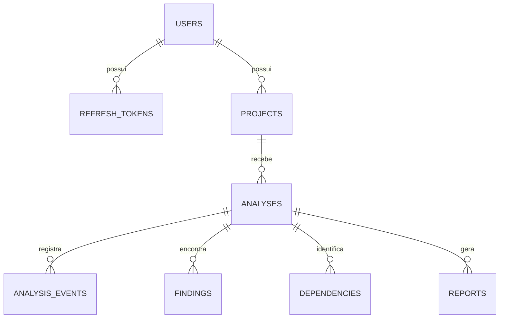

# CodeFortress — Modelo de Banco de Dados

## Princípios

- PostgreSQL será o banco principal.
- Todas as chaves principais utilizarão UUID.
- Datas serão armazenadas com fuso horário.
- Alterações no banco serão realizadas pelo Flyway.
- Cada análise manterá seus próprios resultados.
- Dados de usuários diferentes permanecerão isolados.
- Código-fonte completo não será armazenado no banco.
- Tokens e segredos nunca serão armazenados em texto puro.

## Relacionamentos



## `users`

Representa uma pessoa cadastrada.

| Coluna | Tipo | Regra |
|---|---|---|
| `id` | UUID | Chave primária |
| `email` | VARCHAR(320) | Obrigatório e único |
| `password_hash` | VARCHAR(255) | Obrigatório |
| `display_name` | VARCHAR(120) | Obrigatório |
| `status` | VARCHAR(20) | `ACTIVE` ou `DISABLED` |
| `created_at` | TIMESTAMPTZ | Obrigatório |
| `updated_at` | TIMESTAMPTZ | Obrigatório |

O e-mail será normalizado para letras minúsculas antes de ser salvo.

A senha original nunca será armazenada.

## `refresh_tokens`

Representa uma sessão renovável.

| Coluna | Tipo | Regra |
|---|---|---|
| `id` | UUID | Chave primária |
| `user_id` | UUID | FK para `users` |
| `token_hash` | VARCHAR(255) | Obrigatório e único |
| `expires_at` | TIMESTAMPTZ | Obrigatório |
| `revoked_at` | TIMESTAMPTZ | Opcional |
| `replaced_by_id` | UUID | Token que substituiu o atual |
| `created_at` | TIMESTAMPTZ | Obrigatório |
| `user_agent` | VARCHAR(500) | Opcional |

O refresh token enviado ao navegador não será salvo diretamente. O banco guardará apenas seu hash.

## `projects`

Representa uma aplicação pertencente ao usuário.

| Coluna | Tipo | Regra |
|---|---|---|
| `id` | UUID | Chave primária |
| `owner_id` | UUID | FK para `users` |
| `name` | VARCHAR(120) | Obrigatório |
| `description` | VARCHAR(500) | Opcional |
| `status` | VARCHAR(20) | `ACTIVE` ou `ARCHIVED` |
| `created_at` | TIMESTAMPTZ | Obrigatório |
| `updated_at` | TIMESTAMPTZ | Obrigatório |

O mesmo usuário não poderá possuir dois projetos ativos com o mesmo nome.

A exclusão será lógica: o projeto será marcado como `ARCHIVED`.

## `analyses`

Representa uma execução do motor de segurança.

| Coluna | Tipo | Regra |
|---|---|---|
| `id` | UUID | Chave primária |
| `project_id` | UUID | FK para `projects` |
| `sequence_number` | INTEGER | Número da análise no projeto |
| `status` | VARCHAR(20) | Estado do processamento |
| `source_type` | VARCHAR(20) | Inicialmente `UPLOAD` |
| `source_reference` | VARCHAR(255) | Hash SHA-256 do arquivo |
| `source_filename` | VARCHAR(255) | Nome seguro do ZIP |
| `rule_set_version` | VARCHAR(30) | Versão das regras |
| `score_version` | VARCHAR(30) | Versão do cálculo |
| `security_score` | SMALLINT | De 0 a 100 |
| `files_scanned` | INTEGER | Total de arquivos |
| `lines_scanned` | BIGINT | Total de linhas |
| `findings_count` | INTEGER | Total encontrado |
| `started_at` | TIMESTAMPTZ | Início do processamento |
| `completed_at` | TIMESTAMPTZ | Final do processamento |
| `failure_code` | VARCHAR(50) | Código seguro de erro |
| `failure_message` | VARCHAR(500) | Mensagem sem dados sensíveis |
| `created_at` | TIMESTAMPTZ | Obrigatório |

Status possíveis:

```text
QUEUED
RUNNING
COMPLETED
FAILED
CANCELLED
```

A combinação de `project_id` e `sequence_number` será única.

## `analysis_events`

Registra o progresso real de uma análise.

| Coluna | Tipo | Regra |
|---|---|---|
| `id` | BIGSERIAL | Chave primária e cursor SSE |
| `analysis_id` | UUID | FK para `analyses` |
| `stage` | VARCHAR(30) | Etapa atual |
| `level` | VARCHAR(20) | `INFO`, `WARNING` ou `ERROR` |
| `message` | VARCHAR(300) | Mensagem segura |
| `progress` | SMALLINT | De 0 a 100 |
| `created_at` | TIMESTAMPTZ | Obrigatório |

Exemplos de etapas:

```text
UPLOAD_VALIDATION
FILE_DISCOVERY
SOURCE_ANALYSIS
CONFIGURATION_ANALYSIS
DEPENDENCY_ANALYSIS
SECURITY_RULES
FINISHED
```

Como os eventos ficam no banco, atualizar a página não apagará o progresso já registrado.

## `findings`

Representa um possível problema encontrado.

| Coluna | Tipo | Regra |
|---|---|---|
| `id` | UUID | Chave primária |
| `analysis_id` | UUID | FK para `analyses` |
| `rule_key` | VARCHAR(100) | Identificador da regra |
| `rule_version` | VARCHAR(30) | Versão da regra |
| `fingerprint` | VARCHAR(64) | Identificador para comparação |
| `title` | VARCHAR(200) | Obrigatório |
| `category` | VARCHAR(30) | Categoria do problema |
| `severity` | VARCHAR(20) | Severidade |
| `status` | VARCHAR(30) | Estado de triagem |
| `file_path` | VARCHAR(1000) | Caminho normalizado |
| `start_line` | INTEGER | Linha inicial |
| `end_line` | INTEGER | Linha final |
| `code_excerpt` | TEXT | Trecho mascarado |
| `description` | TEXT | Explicação |
| `impact` | TEXT | Possível impacto |
| `recommendation` | TEXT | Como corrigir |
| `created_at` | TIMESTAMPTZ | Obrigatório |
| `status_updated_at` | TIMESTAMPTZ | Última alteração |

Categorias:

```text
SECRETS
CONFIGURATION
CODE
DEPENDENCY
```

Severidades:

```text
CRITICAL
HIGH
MEDIUM
LOW
```

Status:

```text
OPEN
RESOLVED
ACCEPTED_RISK
FALSE_POSITIVE
```

## Fingerprint

O fingerprint permitirá reconhecer o mesmo problema em análises diferentes.

Exemplo conceitual:

```text
SHA-256(
    rule_key
    + caminho normalizado
    + evidência normalizada
)
```

Na comparação:

- existe apenas na análise atual: finding novo;
- existe nas duas análises: finding persistente;
- existia anteriormente e desapareceu: finding corrigido.

Marcar manualmente como `RESOLVED` não prova que o código foi corrigido. A correção será confirmada quando uma nova análise não encontrar o mesmo fingerprint.

## `dependencies`

Representa uma dependência declarada no projeto.

| Coluna | Tipo | Regra |
|---|---|---|
| `id` | UUID | Chave primária |
| `analysis_id` | UUID | FK para `analyses` |
| `ecosystem` | VARCHAR(20) | `MAVEN` ou `NPM` |
| `name` | VARCHAR(300) | Nome da dependência |
| `declared_version` | VARCHAR(100) | Versão declarada |
| `file_path` | VARCHAR(1000) | Arquivo de origem |
| `line_number` | INTEGER | Linha aproximada |
| `status` | VARCHAR(20) | Estado da verificação |

No primeiro MVP, o sistema poderá apenas inventariar dependências.

Uma dependência só poderá ser chamada de vulnerável quando houver uma fonte real e verificável de advisories.

## `reports`

Representa um relatório gerado.

| Coluna | Tipo | Regra |
|---|---|---|
| `id` | UUID | Chave primária |
| `analysis_id` | UUID | FK para `analyses` |
| `status` | VARCHAR(20) | Estado da geração |
| `storage_key` | VARCHAR(500) | Local do arquivo |
| `sha256` | VARCHAR(64) | Integridade do PDF |
| `created_at` | TIMESTAMPTZ | Obrigatório |
| `expires_at` | TIMESTAMPTZ | Opcional |

Status:

```text
QUEUED
GENERATING
READY
FAILED
```

O PDF não será armazenado dentro da tabela. O banco guardará apenas sua referência.

## Security Score e histórico

O `security_score` será calculado quando a análise terminar e será salvo em `analyses`.

Alterar manualmente o status de um finding não modificará retroativamente o score daquela análise.

Para o score melhorar, o usuário deverá corrigir o código e executar uma nova análise.

Isso mantém o histórico confiável:

```text
Analysis #1 → 61
Analysis #2 → 72
Analysis #3 → 87
```

## Entidades adiadas

Não criaremos agora:

- `organizations`;
- `teams`;
- `roles`;
- `github_installations`;
- `repository_connections`;
- `custom_rules`;
- `subscriptions`.

Essas tabelas somente serão criadas quando suas funcionalidades forem implementadas.